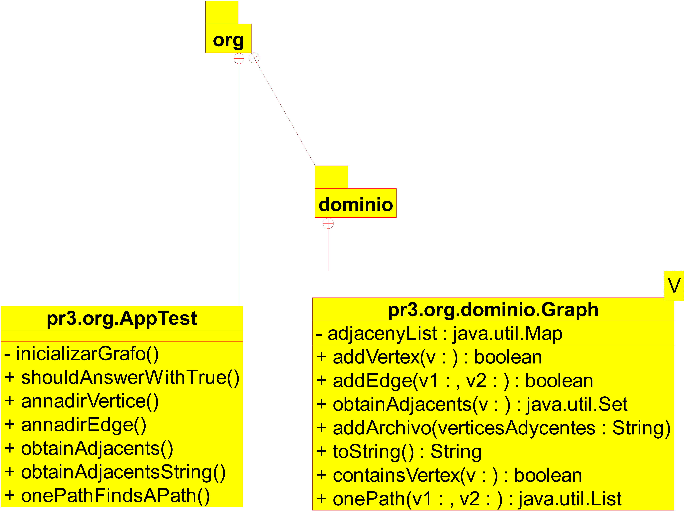

# README #
*2/03/2021 - 10/03/2021*  

>Copyright [2021] (Alejandro Ramirez Larena copyright)
Licensed under the Apache License, Version 2.0 (the "License");
you may not use this file except in compliance with the License.
You may obtain a copy of the License at
http://www.apache.org/licenses/LICENSE-2.0
Unless required by applicable law or agreed to in writing, software
distributed under the License is distributed on an "AS IS" BASIS,
WITHOUT WARRANTIES OR CONDITIONS OF ANY KIND, either express or implied.
See the License for the specific language governing permissions and
limitations under the License.  

**Trabajo Programacion III**

### Proyecto III ###

-El programa es capaz medinte test de crear un Grafo y obtiene el camino a recorrer para llegar de un vertice a otro.

### Comandos para compilar y generar javadoc ###

-He usado MAVEN entonces los comandos para compilar son los usados en MAVEN.

### Ejemplo del juego de la Vida ###

### Como usar ###
-Para ejecutar el programa hay que pasar los test con el comando mvn test.

### Realizado por:

Alejandro Ramirez Larena  
 

### Diagrama UML###

-Este es el digrama creado con Umbrello de el programa.  

